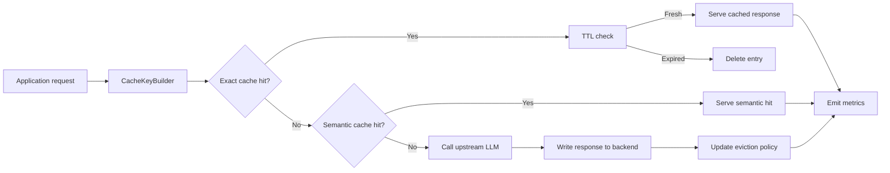
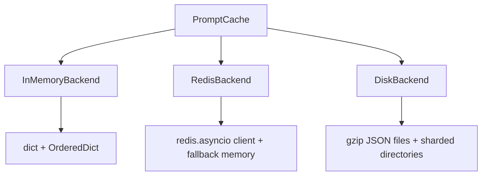
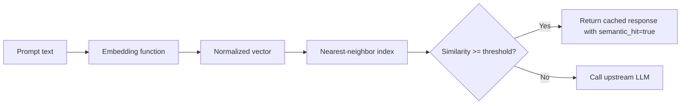
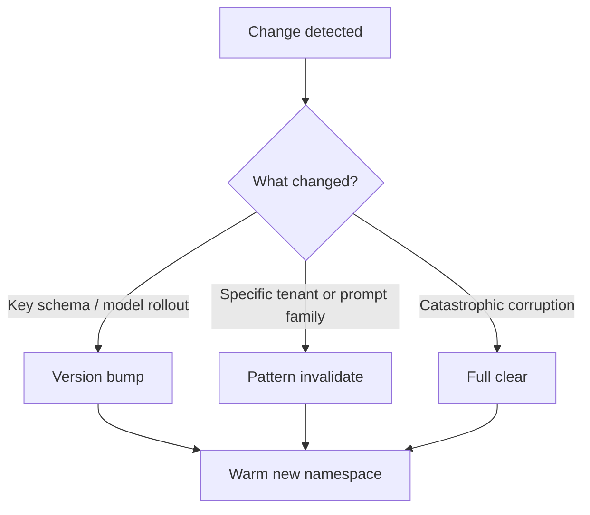
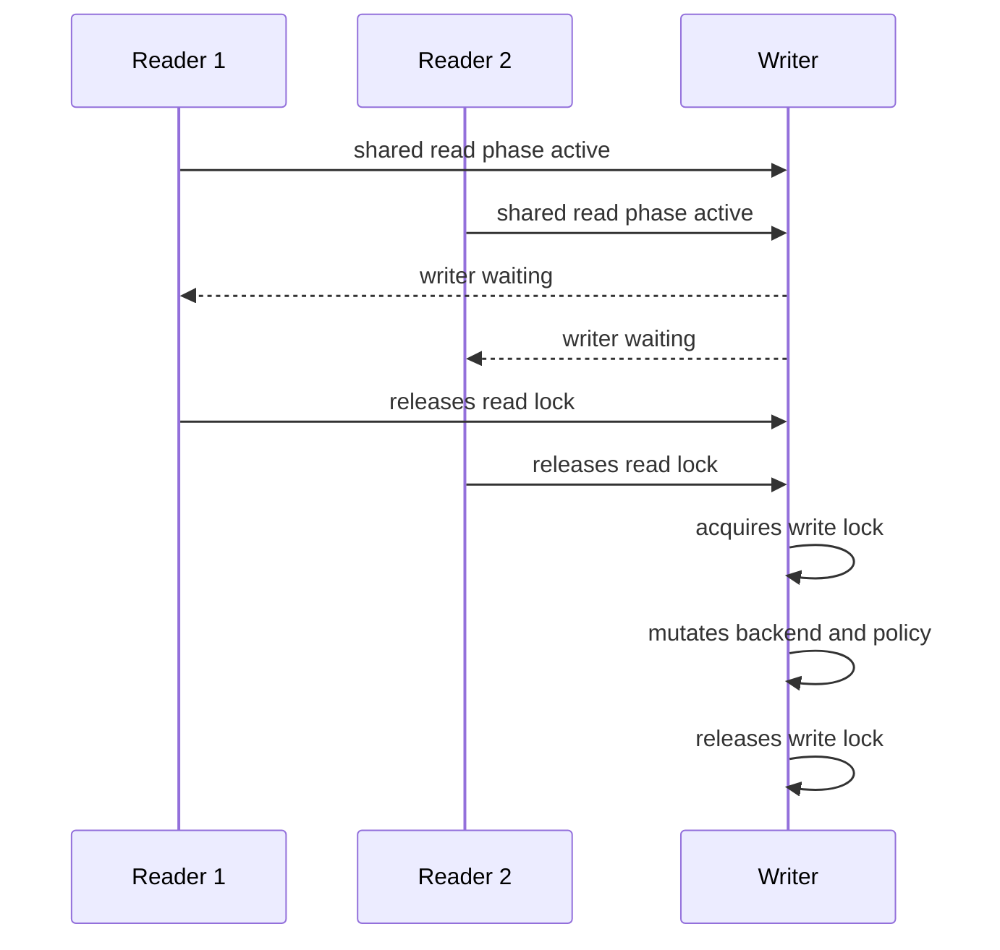
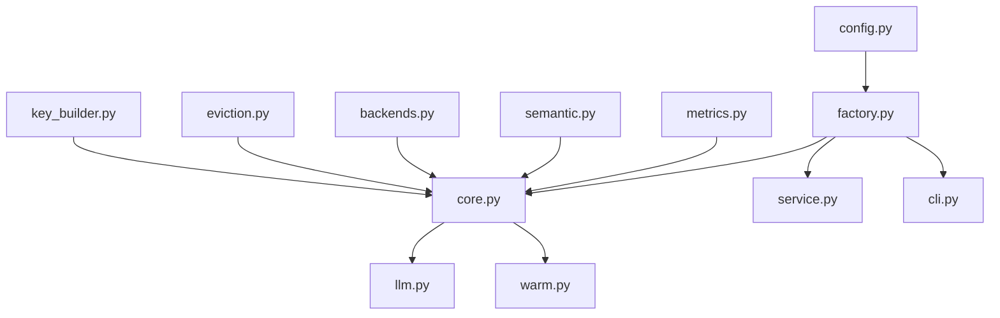
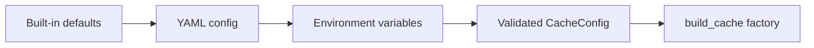
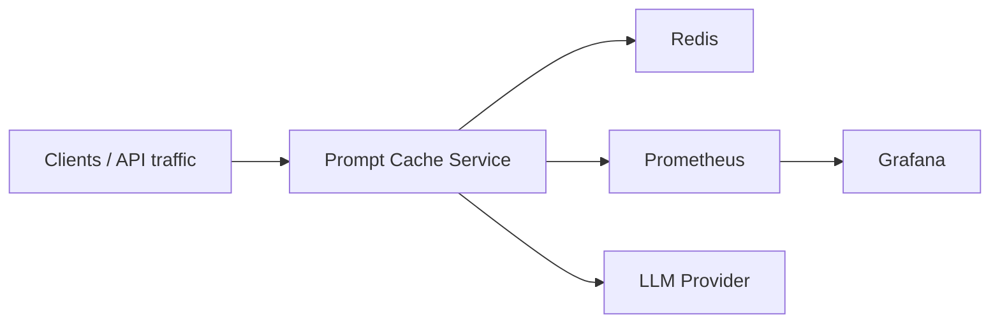

# Build Your Own Prompt Caching Mechanism

This repository is both a runnable reference implementation and a technical deep-dive for prompt caching in production LLM systems. The code lives under `src/prompt_cache`, the validation surface lives under `tests` and `benchmarks`, and the operational bundle lives under `deploy`, `config`, `Dockerfile`, and `docker-compose.yml`.

## 1. Introduction & Motivation

Prompt caching looks superficially similar to HTTP response caching, but the decision surface is materially harder. HTTP caches usually key on a URL, a small header set, and explicit cache directives. LLM calls carry far more entropy: prompt text, system prompts, model versions, temperature, max token budgets, tool schemas, retrieval context, and often hidden application state. A cache that ignores those dimensions returns incorrect answers. A cache that includes too many noisy dimensions fragments itself into irrelevance.

LLM prompts are also not purely deterministic artifacts. Two requests can be semantically equivalent while being textually different, and two textually identical requests can reasonably deserve different answers if the model, system prompt, or temperature changes. That makes prompt caching a hybrid of exact memoization, freshness management, and policy engineering. HTTP caches mostly optimize for byte identity. Prompt caches must optimize for behavioral equivalence.

The three biggest wins from a well-implemented prompt cache are straightforward. First, latency collapses from upstream model latency to local lookup latency on cache hits. Second, cost drops because repeated prompts no longer reconsume input and output tokens. Third, throughput increases because repeated traffic is absorbed by the cache tier instead of queuing behind rate-limited upstream APIs. In high-repeat agent loops, FAQ bots, and retrieval-heavy copilots, those three wins compound fast.

```text
HTTP caching                     Prompt caching
---------------------------      --------------------------------------------
GET /items/42                    prompt + model + system + sampling params
ETag / Cache-Control             TTL + invalidation + semantic threshold
Usually deterministic bytes      Probabilistic model behavior
Header-driven freshness          App-driven freshness and versioning
Exact-match dominant             Exact match + optional fuzzy match
```

> ⚠️ Pitfall: Treating prompt caching as string-to-string memoization is the fastest way to ship subtle correctness bugs. If model name, system prompt, or temperature changes are not encoded in the cache key, the cache becomes a silent data corruption layer.

## 2. Core Architecture Overview

Production prompt caches should sit as middleware between the application and the LLM client, not as ad hoc dictionaries hidden inside business logic. That separation matters because cache lookups, write-back, invalidation, semantic matching, metrics, and backend selection all evolve independently. When those concerns are coupled directly to application code, operational changes become code changes.

The architecture in this repository uses five explicit roles: a key builder, a storage backend, an eviction policy, an optional semantic cache layer, and a metrics collector. The application submits a prompt plus parameters. The middleware canonicalizes the request, attempts an exact lookup, optionally falls back to semantic similarity on miss, calls the upstream API only when required, then writes the result back while updating TTL, eviction, and observability state.

That layering mirrors familiar cache hierarchies in other systems. CPU caches separate lookup from replacement policy. CDNs separate edge storage from invalidation and observability. Prompt caches need the same discipline because LLM workloads are expensive enough that bad caching strategy is immediately visible in cost and latency curves.

```text
┌──────────────────────────────────────────────────────────────────────────────┐
│                           APPLICATION LAYER                                 │
│                 Your API / worker / agent loop / chat service               │
└───────────────────────────────┬──────────────────────────────────────────────┘
								│ prompt + llm params
								▼
┌──────────────────────────────────────────────────────────────────────────────┐
│                         CACHE MIDDLEWARE LAYER                              │
│  Key Builder -> Exact Lookup -> TTL Check -> Semantic Lookup -> Metrics     │
│      │             │ hit             │ expired            │ fuzzy hit        │
│      │             ├────────────────>│ serve              ├──────────────┐   │
│      │             │                 │                    │              │   │
│      │             └ miss ────────────────────────────────┘              │   │
└──────┼────────────────────────────────────────────────────────────────────┼───┘
	   │                                                                    │
	   ▼                                                                    ▼
┌──────────────────────────────────────┐           ┌──────────────────────────────┐
│         STORAGE BACKEND LAYER        │           │          LLM API LAYER        │
│  Memory  |  Redis  |  Disk (gzip)    │<----------│  Anthropic / OpenAI / custom  │
│  TTL     |  size   |  key listing    │ writeback │  on cache miss only           │
└──────────┬───────────────────────────┘           └──────────────┬───────────────┘
		   │ eviction trigger / invalidation / clear                             │
		   └──────────────────────────────────────────────────────────────────────┘
```



> ⚠️ Pitfall: Do not let the backend choose eviction implicitly while the middleware maintains a separate eviction policy. You will drift out of sync. In this implementation the middleware owns policy decisions and asks the backend to store, delete, and enumerate keys.

## 3. Cache Key Design & Hashing Strategy

Cache keys are the correctness boundary. If the key is underspecified, the cache serves stale or semantically wrong answers. If it is overspecified, hit rate collapses because operational metadata such as trace IDs or request-local bookkeeping splinters the keyspace. The right strategy is canonicalization: normalize the inputs that define model behavior, exclude the inputs that do not, then hash the canonical representation.

This repository uses a `CacheKeyBuilder` that normalizes prompt text with Unicode NFKC normalization, lowercasing, and whitespace collapsing. It also canonicalizes metadata into a JSON-safe structure with sorted keys. Bulky or sensitive fields such as the system prompt are represented as a stable SHA-256 hash rather than raw text in the key. Finally, the canonical JSON is hashed again and prefixed with a namespace and version so environments and schema revisions are isolated.

That design is analogous to canonical request signing in APIs and content-addressable storage in build systems. The exact string representation should not matter. The semantic request envelope should. Version prefixes are particularly important because they provide a clean operational invalidation story: bump the version when key semantics change and the old keyspace becomes inert.

```text
Raw Prompt String
	│
	▼ normalize_text()
Lowercased + whitespace-collapsed + NFKC-normalized text
	│
	▼ canonicalize(metadata)
Canonical JSON-safe structure with sorted keys
	│
	▼ SHA-256
'a3f8b2c9d1e4...'
	│
	▼ namespace + version
'prod:v1:a3f8b2c9d1e4...'
```

```python
from prompt_cache.key_builder import CacheKeyBuilder

builder = CacheKeyBuilder(namespace='prod', version='v1')
key = builder.build_key(
	'  Explain   prompt caching\n',
	model='claude-sonnet-4-20250514',
	temperature=0.0,
	max_tokens=1024,
	system='You are a terse systems engineer.',
)
```

Trade-offs:

| Decision | Benefit | Cost |
|---|---|---|
| Lowercase + whitespace collapse | Higher hit rate for formatting-only differences | Can over-normalize if case conveys semantics |
| Hash system prompt | Compact, safe key material | Harder to debug without side metadata |
| Namespace + version prefix | Cheap environment and rollout isolation | More keys to manage across versions |
| Canonical JSON + SHA-256 | Deterministic, collision-resistant keys | Slight CPU overhead per request |

> ⚠️ Pitfall: Keep response-derived metadata out of key material. In this implementation, fields such as `tokens_used` and `estimated_cost_usd` are stored in entry metadata but explicitly removed before key generation. Otherwise a cache write will poison future reads by changing the key shape.

## 4. Storage Backends

Prompt caches need multiple storage backends because deployment environments vary more than textbooks suggest. A single-process development server wants an in-memory cache for microsecond access. A horizontally scaled API tier wants Redis so workers share state. A workstation or edge node with limited infrastructure may prefer a disk-backed cache that survives restarts without requiring an external dependency.

Those backends are not interchangeable from an operational perspective. Memory is fastest but volatile. Redis is network-bound but gives shared state, TTL primitives, and mature ops tooling. Disk is slower and operationally clumsier, but it is attractive when external services are unavailable or overkill. The repository implements all three behind the same `CacheBackend` interface so the orchestrator does not care where the bytes live.

The right analogy is storage tiering in databases. Hot data belongs in RAM, shared mutable state often belongs in a network store, and durable warm state sometimes belongs on disk. The cache layer should let you choose explicitly rather than forcing one tier to fit every workload.



| Backend | Read path | Durability | Shared across replicas | Operational notes |
|---|---|---|---|---|
| In-memory | Fastest, local RAM | None | No | Best for dev, workers, and sidecars |
| Redis | Network RTT + serialization | Optional via AOF/RDB | Yes | Best default for production |
| Disk | File system I/O + gzip | Host-local | No | Useful for warm restart and edge setups |

> ⚠️ Pitfall: Disk caches need directory sharding. Dumping every entry into a single directory works for toy workloads and becomes miserable once inode counts climb. This implementation shards by the first two hex characters of the key digest.

## 5. Cache Eviction Policies

Every bounded cache eventually faces the same question: which entry should die when capacity is full? Eviction is not a backend concern; it is a workload policy concern. LRU works well when the recent past predicts the near future. LFU works better when long-lived hot keys dominate traffic. SLRU splits the difference by protecting genuinely reused entries from one-off scans.

The implementation here exposes each policy as a strategy class. `LRUPolicy` uses a hash map plus doubly linked list for O(1) insert, access, delete, and victim selection. `LFUPolicy` uses a min-heap keyed by frequency and a monotonic clock for recency tie-breaking, which makes access O(log n). `SLRUPolicy` uses probationary and protected segments so entries must earn their place with a second access.

That last policy matters more than most teams expect. Scan-heavy traffic, such as batch analytics, sitemap crawls, or large evaluation runs, can destroy a pure LRU cache because a wave of one-time accesses evicts the real working set. SLRU limits that damage by treating first access as a trial period rather than proof of long-term value.

```text
LRU structure

Hash map                                  Doubly linked list
---------                                 ------------------
key 'a' -> node_a                         HEAD <-> a <-> b <-> c <-> TAIL
key 'b' -> node_b                         ^ LRU                    MRU ^
key 'c' -> node_c

GET('b')
1. map lookup -> node_b
2. unlink node_b
3. move node_b before TAIL

Result: HEAD <-> a <-> c <-> b <-> TAIL

PUT('d') when full
1. evict HEAD.next -> 'a'
2. append 'd' before TAIL
```

| Policy | Access complexity | Victim quality | Best workload |
|---|---|---|---|
| LRU | O(1) | Good recency heuristic | Interactive chat and repeated QA |
| LFU | O(log n) | Better for stable hot keys | Long-lived product catalogs, repeated workflows |
| SLRU | O(1) segment moves | More robust to scans | Mixed traffic with bursts and one-time traversals |

Measured bookkeeping cost from `python3 benchmarks/benchmark.py`:

| Policy | Average bookkeeping time |
|---|---|
| LRU | 1.292 µs/op |
| LFU | 1.540 µs/op |
| SLRU | 1.740 µs/op |

> ⚠️ Pitfall: LFU looks mathematically attractive and is often operationally wrong for rapidly shifting workloads. A key that was hot an hour ago can linger forever unless you add aging or decay. Use LFU when historical frequency is actually predictive.

## 6. TTL & Expiry Management

TTL is freshness control, not just garbage collection. The right TTL answers a business question: how long is this prompt/response pair trustworthy? Static documentation queries might tolerate hours. Prompts that depend on live account state or rapidly changing tools may only be safe for seconds. The cache should make that decision explicit rather than letting entries live forever.

This implementation uses absolute TTLs. Entries store `created_at` and `ttl`, and backends respect expiry without turning every cache hit into a sliding renewal. Redis writes preserve remaining TTL rather than resetting it on every access, which matters because sliding expiration would keep old answers alive simply because they are popular.

Expiry cleanup is hybrid. Lazy cleanup happens during reads: if an entry is expired, it is deleted before serving. Eager cleanup happens indirectly through invalidation and backend TTL primitives. That split matches real systems. Fully eager sweeps are expensive. Fully lazy caches accumulate junk. The sweet spot is lazy enforcement on access plus targeted cleanup hooks.

```text
time ───────────────────────────────────────────────────────────────────────▶

t0            t0+30s             t0+60s             t0+90s
│               │                  │                  │
│ write key A   │ key A still      │ key A expires    │ lazy read deletes A
│ ttl=60        │ fresh            │                  │

│ write key B   │ eager invalidation event for model v1 removes B before TTL

Lazy cleanup: remove on read after expiry
Eager cleanup: delete on explicit invalidation / Redis native TTL expiration
```

Trade-offs:

| TTL strategy | Benefit | Cost |
|---|---|---|
| Long TTL | High hit rate and cost savings | Higher staleness risk |
| Short TTL | Better freshness | More upstream traffic |
| Sliding TTL | Keeps hot entries alive | Can preserve stale but popular responses |
| Absolute TTL | Predictable freshness boundary | Requires deliberate rewarming |

> ⚠️ Pitfall: TTL should be coupled to data volatility, not just traffic volume. Popular prompts are often the most dangerous to leave stale because they amplify wrong answers fastest.

## 7. Semantic Similarity Caching (Fuzzy Matching)

Exact cache hits are only half the story in real LLM applications. Users paraphrase. Agent loops restate the same request with minor wording changes. Retrieval-augmented prompts often differ in superficial phrasing while asking the same factual question. A semantic cache layer exists to catch those near-misses and trade a small amount of approximation risk for a large reduction in repeated model work.

The repository implements `SemanticCacheLayer` with a configurable embedding function, a cosine-similarity threshold, and an in-memory index. For local development the default embedding is a deterministic hashing-based fallback so the repo stays runnable without GPUs or hosted embedding APIs. In production you would normally inject a model-quality embedding function and keep the threshold conservative.

This is where product judgment matters. Semantic hits are great for factual, idempotent queries such as documentation lookups, SKU questions, or policy explanations. They are risky for creative writing, stateful tool-use prompts, or prompts whose exact wording is part of the task. Treat semantic caching like approximate query answering: high leverage when scoped correctly, dangerous when applied indiscriminately.

```text
Prompt miss
   │
   ▼
Embedding function
   │
   ▼
Normalize vector to unit length
   │
   ▼
Vector index lookup
   │ cosine similarity
   ├── similarity >= threshold -> semantic hit -> fetch cached response
   └── similarity < threshold  -> true miss -> upstream LLM call
```



> ⚠️ Pitfall: Semantic caches fail silently if you use weak embeddings with an aggressive threshold. The result is not usually an exception; it is lower-than-expected hit rate. Benchmark semantic recall separately from exact cache behavior.

## 8. Cache Invalidation Strategies

Invalidation is where most caches stop being academic and start becoming operational. Prompt caches need more than one invalidation mechanism because different failure modes require different blast radii. A model rollout might require version-level invalidation. A safety policy change might require namespace-wide invalidation. A single corrected document or tenant-specific state change might require pattern invalidation.

This repository supports three practical strategies. First, versioned invalidation: bump `version` in the key prefix and the old keyspace becomes dead without a synchronous delete storm. Second, pattern invalidation: `PromptCache.invalidate` accepts Unix shell-style glob patterns, which is useful for targeted cleanup. Third, full clear: useful for maintenance windows, benchmarks, or debugging.

The most important design rule is to make invalidation explicit and observable. Silent background cleanup makes debugging impossible. Version bumps, admin commands, deploy-time hooks, and startup warming are all operationally comprehensible. That is a better model than trying to infer invalidation indirectly from app code.



> ⚠️ Pitfall: Do not make invalidation depend on reconstructing raw prompt text after the fact. Store enough metadata on write to debug and selectively remove entries later. This implementation stores original prompt text and LLM parameters inside entry metadata for exactly that reason.

## 9. Concurrency & Thread Safety

Concurrent prompt caching has two different problems. The first is data safety: readers and writers must not corrupt in-memory structures, backend state, or metrics. The second is contention shape: readers should scale, but writers must not starve. Those are different constraints, and using a single coarse mutex solves the first while often destroying the second.

The orchestrator in this repository uses a fair async read-write lock. Readers may proceed concurrently until a writer arrives, at which point new readers are paused so the writer can drain safely. Backends also maintain their own internal locks because each backend has different mutation surfaces. In-memory storage protects its dictionary and size accounting. Disk storage protects file writes and deletes. Redis uses the client and falls back to memory on connection failure.

One thing this implementation does not attempt is singleflight request coalescing for simultaneous misses on the same key. The cache is thread-safe, but two concurrent misses can still race to the upstream API. That is a deliberate scope choice. Correctness and modularity come first; request coalescing is a valuable follow-on optimization once the basic cache semantics are trustworthy.

```text
Thread / task timeline

Reader 1:  ── acquire read ── lookup ── release ─────────────────────────────
Reader 2:  ── acquire read ── lookup ── release ─────────────────────────────
Writer 1:                 wait ───────── acquire write ─ mutate ─ release ──
Reader 3:                 blocked while writer waits/owns lock ──────────────
```



> ⚠️ Pitfall: Thread-safe does not mean throughput-optimal. If your workload has a thundering herd of identical misses, add singleflight or request collapsing. A safe cache can still waste upstream calls under coordinated bursts.

## 10. Metrics, Observability & Monitoring

If a prompt cache is in production, you need to answer four questions quickly. Is it helping? Is it safe? Is it full? Is it failing open or failing closed? That is why observability is a first-class part of the implementation rather than a logging afterthought. The cache exports counters, latency histograms, derived gauges, JSON snapshots, and Prometheus text exposition.

The core metrics are exactly the ones you would expect from any serious cache: total requests, hits, misses, evictions, errors, cache size, item count, and rolling hit rates. For prompt caches you should also track upstream API latency separately from cache-hit latency, because that tells you whether savings come from the cache or from the model service itself getting faster or slower.

Metrics also support debugging. A drop in hit rate after a deploy often means key semantics changed. A spike in evictions usually means the cache is undersized or traffic shifted. A gap between exact-hit rate and semantic-hit rate can tell you whether prompt restatements are common enough to justify approximate matching at all.

```text
Metric families

Counters:   total_requests, cache_hits, cache_misses, evictions, errors
Gauges:     cache_size_bytes, cache_item_count, hit_rate_1m, hit_rate_5m
Histograms: hit_latency_ms, miss_latency_ms, api_latency_ms
Exports:    /metrics for Prometheus, export_json() for health/debug tooling
```

| Metric | Meaning | Where it goes |
|---|---|---|
| `prompt_cache_total_requests` | Every cache lookup | Prometheus counter |
| `prompt_cache_hits` | Exact or semantic hits | Prometheus counter |
| `prompt_cache_misses` | True misses | Prometheus counter |
| `prompt_cache_evictions` | Capacity-driven removals | Prometheus counter |
| `prompt_cache_hit_rate` | Overall hit ratio | Grafana overview panel |
| `prompt_cache_size_bytes` | Approximate cache footprint | Capacity alerting |
| `prompt_cache_api_latency_p95_ms` | Upstream p95 | Provider degradation alert |

> ⚠️ Pitfall: Hit rate alone is not enough. A cache can have a decent hit rate and still be economically useless if the misses are the expensive requests and the hits are tiny prompts. Track savings proxies, upstream token usage, and response class distribution where possible.

## 11. Full Production Implementation (Python)

The implementation is intentionally modular because prompt caching is not one class. It is a collaboration between serialization, key generation, storage, replacement policy, concurrency control, semantic search, metrics, and client integration. Keeping those concerns in separate files makes the repo easier to test, easier to extend, and safer to operate.

The full runnable source is in the repository and maps directly to the concepts in the earlier sections. The most important files are listed below. Together they form the production implementation used by the tests and benchmarks in this repo.

| Module | Purpose |
|---|---|
| `src/prompt_cache/types.py` | Shared dataclasses such as `CacheEntry`, `CacheStats`, and `CompletionResult` |
| `src/prompt_cache/interfaces.py` | Abstract storage, eviction, and semantic matcher contracts |
| `src/prompt_cache/key_builder.py` | Deterministic prompt key construction |
| `src/prompt_cache/eviction.py` | LRU, LFU, and SLRU policies |
| `src/prompt_cache/backends.py` | In-memory, Redis, and disk backends |
| `src/prompt_cache/semantic.py` | Embedding and cosine-similarity lookup |
| `src/prompt_cache/core.py` | Main `PromptCache` orchestrator |
| `src/prompt_cache/llm.py` | `CachedLLMClient` wrapper for upstream API calls |
| `src/prompt_cache/metrics.py` | Metrics collection and export |
| `src/prompt_cache/warm.py` | Warm-start and cache-dump helpers |
| `src/prompt_cache/service.py` | FastAPI health and metrics service |
| `src/prompt_cache/cli.py` | CLI entrypoint |



Representative implementation excerpts follow. They are the core logic surfaces engineers usually modify first.

```python
from dataclasses import dataclass, field
from typing import Any
import time


@dataclass(slots=True)
class CacheEntry:
	key: str
	value: Any
	created_at: float
	ttl: float | None
	hit_count: int = 0
	metadata: dict[str, Any] = field(default_factory=dict)
	last_accessed: float = field(default_factory=time.time)

	@property
	def expires_at(self) -> float | None:
		if self.ttl is None:
			return None
		return self.created_at + self.ttl

	def is_expired(self, now: float | None = None) -> bool:
		if self.ttl is None:
			return False
		current_time = time.time() if now is None else now
		return current_time >= self.created_at + self.ttl


class CacheBackend(ABC):
	@abstractmethod
	async def get(self, key: str) -> CacheEntry | None: ...

	@abstractmethod
	async def set(self, key: str, entry: CacheEntry) -> None: ...

	@abstractmethod
	async def delete(self, key: str) -> bool: ...

	@abstractmethod
	async def clear(self) -> None: ...
```

```python
class CacheKeyBuilder:
	def __init__(self, namespace: str = 'default', version: str = 'v1', exclude_params: set[str] | None = None) -> None:
		self.namespace = namespace.strip() or 'default'
		self.version = version.strip() or 'v1'
		self.exclude_params = {'bypass_cache', 'cache_ttl', 'request_id', 'trace_id'}
		if exclude_params:
			self.exclude_params.update(exclude_params)

	def normalize_text(self, value: str) -> str:
		normalized = unicodedata.normalize('NFKC', value)
		normalized = normalized.strip().lower()
		return re.sub(r'\s+', ' ', normalized)

	def build_components(self, prompt: str, **llm_params: Any) -> dict[str, Any]:
		normalized_prompt = self.normalize_text(prompt)
		metadata: dict[str, Any] = {}
		for key, value in llm_params.items():
			if key in self.exclude_params:
				continue
			if key == 'system' and value is not None:
				metadata['system_hash'] = hashlib.sha256(
					self.normalize_text(str(value)).encode('utf-8')
				).hexdigest()
				continue
			metadata[key] = self._canonicalize(value)
		return {
			'namespace': self.namespace,
			'version': self.version,
			'prompt': normalized_prompt,
			'metadata': self._canonicalize(metadata),
		}

	def build_key(self, prompt: str, **llm_params: Any) -> str:
		canonical_json = dumps_text(self.build_components(prompt, **llm_params))
		digest = hashlib.sha256(canonical_json.encode('utf-8')).hexdigest()
		return f'{self.namespace}:{self.version}:{digest}'
```

```python
class InMemoryBackend(CacheBackend):
	def __init__(self, max_items: int = 10000, max_size_bytes: int = 512 * 1024 * 1024) -> None:
		self.max_items = max_items
		self.max_size_bytes = max_size_bytes
		self._entries: dict[str, CacheEntry] = {}
		self._sizes: dict[str, int] = {}
		self._order: OrderedDict[str, None] = OrderedDict()
		self._current_size_bytes = 0
		self._lock = asyncio.Lock()

	async def get(self, key: str) -> CacheEntry | None:
		async with self._lock:
			entry = self._entries.get(key)
			if entry is None:
				return None
			if entry.is_expired():
				await self._delete_unlocked(key)
				return None
			self._order.move_to_end(key, last=True)
			return CacheEntry.from_dict(entry.to_dict())


class RedisBackend(CacheBackend):
	def __init__(self, redis_url: str | None, *, pool_size: int = 20, socket_timeout_seconds: float = 1.5, client: Any | None = None, fallback_backend: CacheBackend | None = None) -> None:
		self._fallback = fallback_backend or InMemoryBackend(max_items=2048)
		self._client = client
		self._available = client is not None or (aioredis is not None and bool(redis_url))
		if self._client is None and self._available:
			self._client = aioredis.from_url(
				redis_url,
				decode_responses=False,
				max_connections=pool_size,
				socket_timeout=socket_timeout_seconds,
			)

	async def set(self, key: str, entry: CacheEntry) -> None:
		payload = dumps(entry.to_dict())
		if entry.ttl is not None:
			remaining = entry.expires_at - time.time() if entry.expires_at else entry.ttl
			await self._client.setex(key, max(1, int(remaining)), payload)
		else:
			await self._client.set(key, payload)


class DiskBackend(CacheBackend):
	def _path_for_key(self, key: str) -> Path:
		digest = hashlib.sha256(key.encode('utf-8')).hexdigest()
		return self.cache_dir / digest[:2] / f'{digest}.json.gz'

	async def set(self, key: str, entry: CacheEntry) -> None:
		path = self._path_for_key(key)
		temp_path = path.with_suffix(path.suffix + '.tmp')
		async with self._lock:
			await asyncio.to_thread(path.parent.mkdir, parents=True, exist_ok=True)
			compressed = await asyncio.to_thread(gzip.compress, dumps(entry.to_dict()))
			await self._write_bytes(temp_path, compressed)
			await asyncio.to_thread(os.replace, temp_path, path)
```

```python
class LRUPolicy(EvictionPolicy):
	def __init__(self) -> None:
		self._chain = _LRUChain()

	def record_insert(self, key: str) -> None:
		self._chain.append_mru(key)

	def record_access(self, key: str) -> None:
		self._chain.move_to_mru(key)

	def select_victim(self) -> str | None:
		return self._chain.lru_key()


class LFUPolicy(EvictionPolicy):
	def record_access(self, key: str) -> None:
		frequency, _ = self._state.get(key, (0, 0))
		self._clock += 1
		updated = (frequency + 1, self._clock)
		self._state[key] = updated
		heapq.heappush(self._heap, (updated[0], updated[1], key))


class SLRUPolicy(EvictionPolicy):
	def record_access(self, key: str) -> None:
		if key in self._protected:
			self._protected.move_to_mru(key)
			return
		if key in self._probationary:
			self._probationary.remove(key)
			self._protected.append_mru(key)
			if len(self._protected) > self._protected_capacity:
				demoted = self._protected.pop_lru()
				if demoted is not None:
					self._probationary.append_mru(demoted)
```

```python
class SemanticCacheLayer(SemanticMatcher):
	async def record(self, key: str, prompt: str) -> None:
		vector = await _resolve_embedding(self.embedding_function, prompt)
		async with self._lock:
			self._vectors[key] = vector
			self._dirty = True

	async def find_similar(self, prompt: str) -> tuple[str, float] | None:
		vector = await _resolve_embedding(self.embedding_function, prompt)
		async with self._lock:
			await self._ensure_index()
			best_key = ''
			best_similarity = -1.0
			for key, candidate in self._vectors.items():
				similarity = sum(left * right for left, right in zip(vector, candidate))
				if similarity > best_similarity:
					best_key = key
					best_similarity = similarity
			if best_similarity >= self.similarity_threshold:
				return best_key, best_similarity
			return None


class PromptCache:
	_response_metadata_fields = {
		'api_latency_ms', 'estimated_cost_usd', 'raw_response', 'response_metadata', 'tokens_used'
	}

	async def get(self, prompt: str, **llm_params: Any) -> CacheEntry | None:
		key = self.key_builder.build_key(prompt, **llm_params)
		async with self._lock.read_lock():
			entry = await self.backend.get(key)
		if entry is not None:
			await self._mark_access(key, entry, semantic_hit=False)
			self.metrics.record_hit(self._elapsed_ms(start_ns), semantic_hit=False)
			return entry
		...

	async def set(self, prompt: str, response: Any, **llm_params: Any) -> None:
		llm_params_copy = dict(llm_params)
		ttl = llm_params_copy.pop('cache_ttl', self.default_ttl)
		response_metadata = {
			field: llm_params_copy.pop(field)
			for field in list(llm_params_copy)
			if field in self._response_metadata_fields
		}
		key = self.key_builder.build_key(prompt, **llm_params_copy)
		entry = CacheEntry(
			key=key,
			value=response,
			created_at=time.time(),
			ttl=ttl,
			metadata={
				'prompt': prompt,
				'llm_params': llm_params_copy,
				**response_metadata,
				'semantic_hit': False,
			},
		)
		async with self._lock.write_lock():
			await self.backend.set(key, entry)
			self.eviction_policy.record_insert(key)
			await self._ensure_capacity()
```

```python
class CachedLLMClient:
	async def complete(
		self,
		prompt: str,
		model: str = 'claude-sonnet-4-20250514',
		temperature: float = 0.0,
		max_tokens: int = 1024,
		system: str | None = None,
		bypass_cache: bool = False,
		cache_ttl: float | None = None,
		**extra_params: Any,
	) -> CompletionResult:
		llm_params = {
			'model': model,
			'temperature': temperature,
			'max_tokens': max_tokens,
			'system': system,
			**extra_params,
		}
		if not bypass_cache:
			cached_entry = await self.cache.get(prompt, **llm_params)
			if cached_entry is not None:
				return CompletionResult(
					response=cached_entry.value,
					cached=True,
					cache_key=cached_entry.key,
					latency_ms=self._elapsed_ms(started_ns),
					tokens_used=int(cached_entry.metadata.get('tokens_used', 0)),
					estimated_cost_usd=0.0,
					semantic_hit=bool(cached_entry.metadata.get('semantic_hit', False)),
					metadata=dict(cached_entry.metadata),
				)

		raw_response = await self._completion_callable(prompt=prompt, model=model, temperature=temperature, max_tokens=max_tokens, system=system, **extra_params)
		response_text, tokens_used = self._extract_response_and_usage(raw_response, prompt)
		estimated_cost = self._estimate_cost(model, tokens_used)
		await self.cache.set(
			prompt,
			response_text,
			model=model,
			temperature=temperature,
			max_tokens=max_tokens,
			system=system,
			cache_ttl=cache_ttl,
			tokens_used=tokens_used,
			estimated_cost_usd=estimated_cost,
			**extra_params,
		)
```

The remaining pieces are equally important operationally even if they are less conceptually novel: `metrics.py` exports Prometheus-format text and JSON snapshots, `warm.py` restores and dumps JSONL warm state, `factory.py` builds components from Pydantic settings, `service.py` exposes `/health` and `/metrics`, and `cli.py` provides `stats`, `health`, `warm`, `dump`, `clear`, and `serve` commands.

> ⚠️ Pitfall: Keep the implementation modular, but do not let it become abstract for its own sake. The abstractions in this repo correspond to real operational seams: storage, eviction, semantics, and observability. Anything beyond that is usually architecture theater.

## 12. CLI & Configuration Reference

Configuration needs to support three audiences simultaneously: developers running locally, operators deploying containers, and services injecting environment-specific overrides at runtime. Pydantic settings are a good fit because they give typed defaults, environment variable overrides, and predictable validation behavior. YAML sits underneath that as a human-readable baseline.

The CLI exists for two reasons. First, it makes the cache operationally observable outside the application path. Second, it turns lifecycle actions such as warming, dumping, or clearing the cache into explicit commands rather than bespoke scripts. The cache should be operable by humans under pressure; that is part of being production-ready.

The resolution order in this repo is straightforward: start with built-in defaults, layer YAML on top, then let `PROMPT_CACHE_*` environment variables override anything needed for the runtime environment. That mirrors how serious services are normally deployed.



CLI commands:

| Command | Purpose |
|---|---|
| `prompt-cache stats --config config/prompt-cache.yml` | Emit JSON stats |
| `prompt-cache health --config config/prompt-cache.yml` | Emit compact health summary |
| `prompt-cache warm --config config/prompt-cache.yml data.jsonl` | Preload prompt/response pairs |
| `prompt-cache dump --config config/prompt-cache.yml dump.jsonl` | Persist live entries |
| `prompt-cache clear --config config/prompt-cache.yml` | Clear all entries |
| `prompt-cache serve --config config/prompt-cache.yml` | Run FastAPI service |

Example YAML:

```yaml
backend: redis
eviction_policy: slru
max_size_mb: 512.0
max_items: 50000
default_ttl_seconds: 3600.0
redis_url: redis://redis:6379/0
namespace: prod
version: v1
enable_metrics: true
```

> ⚠️ Pitfall: Configuration that is easy to override is also easy to accidentally shadow. Keep a single authoritative config source for each environment and make environment-variable overrides intentional rather than ambient shell debris.

## 13. Testing Strategy

Caching bugs are disproportionately nasty because they often look like success. The service is fast. The answers seem plausible. The incident only becomes obvious when somebody notices the wrong model output served from the wrong context. That is why cache testing must cover not just the happy path, but key stability, expiry, concurrency, and eviction behavior under constrained capacity.

This repo uses three layers of validation. Unit tests isolate deterministic components such as key generation and eviction policies. Integration tests drive the full `PromptCache` and `CachedLLMClient` against mock upstream calls. Property-based tests probe invariants such as key determinism and capacity bounds across randomized inputs. Together they cover the failure modes that usually survive naive testing.

At the time of writing, the repository validates with `python3 -m pytest` and reports `15 passed, 2 skipped`. The skips are optional-dependency dependent surfaces such as fakeredis or Hypothesis when those extras are not installed in the current environment.

```text
Test pyramid

		   /\
		  /  \        Property tests: invariants under random input
		 /----\
		/      \      Integration tests: PromptCache + client + backend behavior
	   /--------\
	  /          \    Unit tests: key builder, policies, TTL, metrics
	 /____________\
```

Unit-test example:

```python
def test_identical_prompts_with_whitespace_noise_share_key() -> None:
	builder = CacheKeyBuilder(namespace='prod', version='v2')
	left = builder.build_key('Hello   world\n', model='claude', temperature=0.0)
	right = builder.build_key(' hello world ', model='claude', temperature=0.0, trace_id='abc')
	assert left == right
```

Integration-test example:

```python
@pytest.mark.asyncio
async def test_cached_llm_client_reuses_cached_response(mocker) -> None:
	llm_callable = mocker.AsyncMock(return_value={'response': '42', 'tokens_used': 128})
	client = CachedLLMClient(_cache(), llm_callable)
	first = await client.complete('What is 6 * 7?')
	second = await client.complete('What is 6 * 7?')
	assert first.cached is False
	assert second.cached is True
	assert llm_callable.await_count == 1
```

Property-based example:

```python
@given(prompt=st.text(min_size=0, max_size=128), model=st.text(min_size=1, max_size=32))
def test_same_prompt_always_produces_same_key(prompt: str, model: str) -> None:
	builder = CacheKeyBuilder()
	assert builder.build_key(prompt, model=model) == builder.build_key(prompt, model=model)
```

> ⚠️ Pitfall: A cache that only passes deterministic unit tests can still fail under concurrency or on randomized prompt normalization edge cases. Include `asyncio.gather` tests and invariant-based tests, not just direct lookup assertions.

## 14. Benchmark Results & Performance Analysis

Benchmarks for prompt caches should measure more than raw hit latency. You also want key-building overhead, memory overhead per entry, and policy bookkeeping cost. More importantly, benchmark methodology must reflect mixed workloads. This repository uses semaphore-limited concurrency rather than coarse request batches so fast cache hits are not artificially blocked behind slow misses.

The benchmark harness in `benchmarks/benchmark.py` uses an 85 ms mock upstream completion to keep local runs fast while preserving the relative shape of cache benefits. Because upstream latency dominates cost in real systems, the shape scales. If your provider averages 850 ms instead of 85 ms, the qualitative results are the same and the absolute savings are roughly 10x larger.

The measured results below came from this implementation on this machine. The key takeaway is not that every workload gets 3948 req/s at a 99.5% hit rate. The real takeaway is that once repeat traffic becomes dominant, latency collapses and throughput becomes bounded by local CPU and serialization rather than the model provider.

```text
Cost savings vs hit rate

100% |                                   * 99.5% hit
 80% |                        * 89.75% hit
 60% |              * 59.25% hit
 40% |
 20% |        * semantic 69.5%
  0% |* no cache
	  +------------------------------------------------
		0           50           90          99 hit rate
```

Measured benchmark table:

| Scenario | Avg Latency | P99 Latency | Throughput | Observed Hit Rate | Approx. Cost Savings |
|---|---:|---:|---:|---:|---:|
| No cache | 85.89 ms | 86.43 ms | 577.64 req/s | 0.00% | 0% |
| 50% hit rate | 58.17 ms | 194.15 ms | 581.39 req/s | 59.25% | ~59% |
| 90% hit rate | 9.00 ms | 87.58 ms | 2114.41 req/s | 89.75% | ~90% |
| 99% hit rate | 0.51 ms | 0.17 ms | 3948.14 req/s | 99.50% | ~99% |
| Semantic cache 85% target | 35.85 ms | 153.32 ms | 800.39 req/s | 69.50% | ~70% |

Additional measured costs:

| Measurement | Result |
|---|---:|
| Average cache-key build time | 0.024005 ms |
| LRU bookkeeping | 1.292 µs/op |
| LFU bookkeeping | 1.540 µs/op |
| SLRU bookkeeping | 1.740 µs/op |

How to reproduce:

```bash
python3 benchmarks/benchmark.py
```

Interpretation notes:

- The 50% throughput line stays near the no-cache line because half the workload still pays upstream latency, so throughput remains partly provider-bound.
- The semantic scenario underperforms the target hit rate because the default local embedding fallback is intentionally lightweight. A production embedding model will usually recover more of those misses.
- The 99% scenario shows the true ceiling of the cache path: once misses are rare, the system is mostly measuring local orchestration overhead.

> ⚠️ Pitfall: Benchmarks that only report average latency are misleading. P99, memory-per-entry, and key-generation cost matter because they tell you whether the cache is merely fast on average or predictably cheap under pressure.

## 15. Deployment Guide

Production deployment is not just packaging the Python code. It also means choosing a shared backend, exposing health and metrics endpoints, persisting warm state when appropriate, and setting alerts on the right degradation signals. In practice, that means a small control plane around the cache: Redis, Prometheus, Grafana, and a clear startup/shutdown story.

This repo ships that bundle directly. The container image runs the FastAPI service from `prompt_cache.service:create_default_app`. The compose stack wires the app to Redis, Prometheus scrapes `/metrics`, and Grafana loads a prebuilt dashboard with hit rate, latency, cache size, and cost-savings proxy panels. Redis persistence is enabled with AOF and periodic snapshots.

The deployment model is intentionally conservative. The cache fails open to a local in-memory fallback if Redis disappears, the service exposes `/health`, and configuration stays explicit through `PROMPT_CACHE_*` variables plus a mounted YAML file. That is what you want in front of an expensive upstream dependency: graceful degradation, not dramatic failure.



Dockerfile:

```dockerfile
FROM python:3.12-slim

ENV PYTHONUNBUFFERED=1 \
	PIP_NO_CACHE_DIR=1

WORKDIR /app

COPY pyproject.toml README.md /app/
COPY src /app/src

RUN pip install --upgrade pip && \
	pip install '.[redis,disk,fast,semantic,service]'

EXPOSE 8000

CMD ['uvicorn', 'prompt_cache.service:create_default_app', '--factory', '--host', '0.0.0.0', '--port', '8000']
```

Docker Compose:

```yaml
services:
  app:
	build:
	  context: .
	  dockerfile: Dockerfile
	environment:
	  PROMPT_CACHE_CONFIG: /app/config/prompt-cache.yml
	  PROMPT_CACHE_BACKEND: redis
	  PROMPT_CACHE_REDIS_URL: redis://redis:6379/0
	volumes:
	  - ./config:/app/config:ro
	  - ./runtime-cache:/var/lib/prompt-cache
	ports:
	  - '8000:8000'
	depends_on:
	  redis:
		condition: service_healthy

  redis:
	image: redis:7.2-alpine
	command: ['redis-server', '--appendonly', 'yes', '--save', '60', '1000']

  prometheus:
	image: prom/prometheus:v2.54.1
	volumes:
	  - ./deploy/prometheus.yml:/etc/prometheus/prometheus.yml:ro

  grafana:
	image: grafana/grafana:11.1.0
	volumes:
	  - ./deploy/grafana-datasource.yml:/etc/grafana/provisioning/datasources/datasource.yml:ro
	  - ./deploy/grafana-dashboard-provider.yml:/etc/grafana/provisioning/dashboards/dashboards.yml:ro
	  - ./deploy/grafana-dashboard.json:/var/lib/grafana/dashboards/prompt-cache.json:ro
```

Prometheus scrape config:

```yaml
global:
  scrape_interval: 15s

scrape_configs:
  - job_name: prompt-cache
	metrics_path: /metrics
	static_configs:
	  - targets: ['app:8000']
```

Grafana dashboard JSON:

The full dashboard is checked in at `deploy/grafana-dashboard.json`. It defines four key panels: hit rate, latency p95, cache size, and a cost-savings proxy derived from hit rate. Keeping the full JSON in a dedicated file is operationally cleaner than inlining several hundred lines of dashboard schema into prose.

Environment variable reference:

| Variable | Type | Default | Description |
|---|---|---|---|
| `PROMPT_CACHE_BACKEND` | string | `memory` | Backend selector: `memory`, `redis`, or `disk` |
| `PROMPT_CACHE_EVICTION_POLICY` | string | `lru` | Eviction policy: `lru`, `lfu`, or `slru` |
| `PROMPT_CACHE_MAX_SIZE_MB` | float | `512.0` | Global cache size budget |
| `PROMPT_CACHE_MAX_ITEMS` | int | `10000` | Maximum tracked items |
| `PROMPT_CACHE_DEFAULT_TTL_SECONDS` | float | `3600.0` | Default TTL for entries |
| `PROMPT_CACHE_REDIS_URL` | string | unset | Redis connection URL |
| `PROMPT_CACHE_REDIS_POOL_SIZE` | int | `20` | Redis connection pool size |
| `PROMPT_CACHE_REDIS_SOCKET_TIMEOUT_SECONDS` | float | `1.5` | Redis socket timeout |
| `PROMPT_CACHE_DISK_CACHE_DIR` | string | `/tmp/prompt_cache` | Disk backend directory |
| `PROMPT_CACHE_SEMANTIC_CACHE_ENABLED` | bool | `false` | Enable semantic similarity caching |
| `PROMPT_CACHE_SEMANTIC_SIMILARITY_THRESHOLD` | float | `0.92` | Semantic hit threshold |
| `PROMPT_CACHE_NAMESPACE` | string | `default` | Cache namespace prefix |
| `PROMPT_CACHE_VERSION` | string | `v1` | Cache key version |
| `PROMPT_CACHE_ENABLE_METRICS` | bool | `true` | Enable `/metrics` endpoint |
| `PROMPT_CACHE_LOG_LEVEL` | string | `INFO` | Service log level |
| `PROMPT_CACHE_SERVICE_HOST` | string | `0.0.0.0` | HTTP bind host |
| `PROMPT_CACHE_SERVICE_PORT` | int | `8000` | HTTP bind port |
| `PROMPT_CACHE_PROTECTED_SEGMENT_RATIO` | float | `0.8` | SLRU protected segment share |
| `PROMPT_CACHE_METRICS_BUFFER_SIZE` | int | `10000` | In-memory metrics window size |

Production checklist:

1. Enable Redis persistence with both AOF and periodic RDB snapshots.
2. Warm the cache on startup with `prompt-cache warm` or by restoring a JSONL dump.
3. Expose `/health` and `/metrics` and put them behind standard service monitoring.
4. Dump cache state on graceful shutdown when warm restart matters more than cold accuracy.
5. Alert when hit rate falls below 30%, p99 API latency exceeds 500 ms, eviction count spikes, or Redis connectivity starts failing over repeatedly.

> ⚠️ Pitfall: A cache is not a substitute for upstream resilience. It reduces load and latency, but if the remaining miss traffic is still critical, you still need retries, rate limiting, circuit breakers, and clear degradation behavior around the LLM provider.
